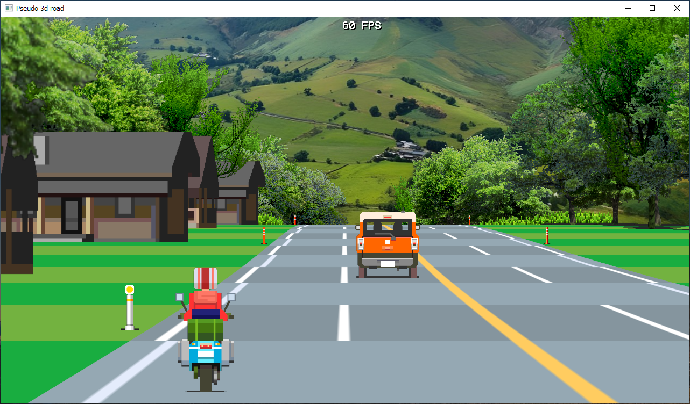
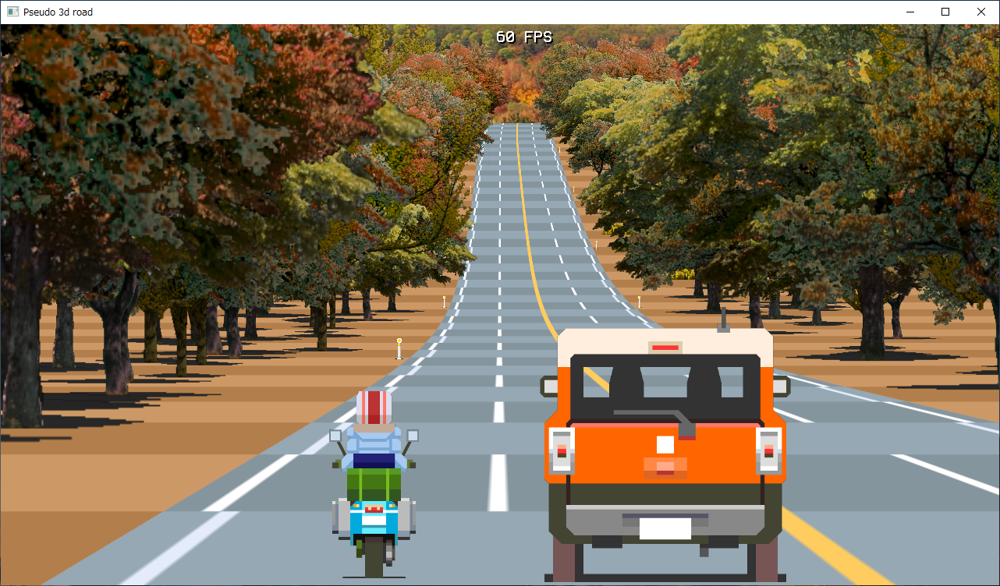
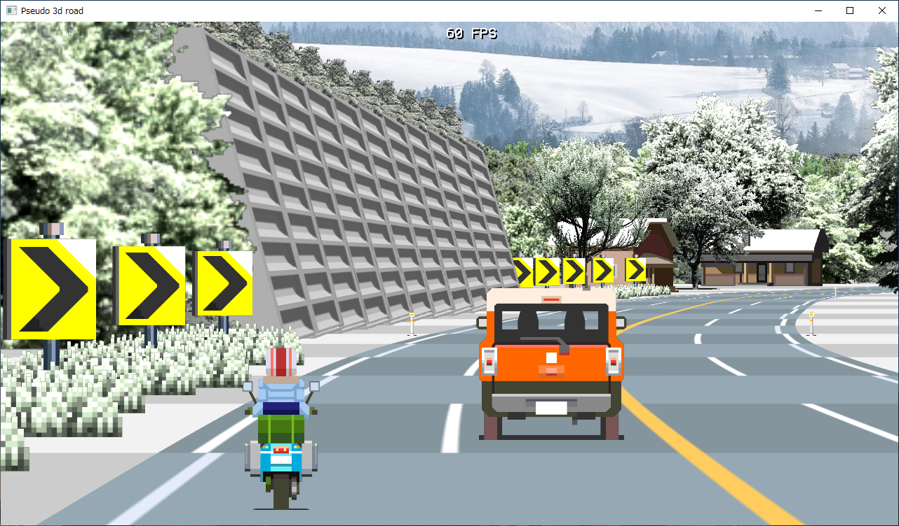

pseudo3droadsample
==================

Description
-----------

Pseudo-3D road drawing sample using C language and OpenGL.

* 02_ps3d : Draw a pseudo-3D road using only lines
* 03_ps3d_tex : Drawing pseudo-3D roads with texture and single color fill
* 04_ps3d_bb : Adding billboards and drawing pseudo-3D roads

Screenshots
-----------

### 02_ps3d


### 03_ps3d_tex


### 04_ps3d_bb








Environment
-----------

### Windows

* Windows10 x64 22H2
* MinGW (gcc 9.2.0, OSDN ver) / MSYS2 (gcc 13.2.0)
* OpenGL
* [glfw 3.3.9 (glfw-3.3.9.bin.WIN32.zip)](https://github.com/glfw/glfw/releases/tag/3.3.9)
* [SOIL (Simple OpenGL Image Library) (WebArchive)](https://web.archive.org/web/20200728145723/http://lonesock.net/soil.html)

### Ubuntu Linux

* Ubuntu Linux 20.04/22.04 LTS
* gcc 9.4.0 (Ubuntu Linux 20.04 LTS) / gcc 11.4.0 (Ubuntu Linux 22.04 LTS)
* OpenGL
* glfw 3.3.2 (libglfw3-dev)
* glfw 3.3.6 (libglfw3-dev)
* SOIL 1.07 (libsoil-dev)

```
sudo apt install libgl1-mesa-dev libglu1-mesa-dev
sudo apt install libglfw3-dev
sudo apt install libsoil-dev
```
 
Build
-----

```
cd 02_ps3d
make
02_ps3d.exe
```

```
cd 03_ps3d_tex
make
03_ps3d_tex.exe
```

```
cd 04_ps3d_bb
make
04_ps3d_bb.exe
```

Note
----

04_ps3d_bb.exe accepts shortcut keys.

* T key : Toggle tree drawing
* S key : Toggle slope drawing
* F key : Change the frame rate to 60 fps, 30 fps, and 20 fps, in that order.

License
-------

CC0 / Public Domain

Author
------

[mieki256](https://github.com/mieki256)

Background images source
------------------------

* [Landscape Spring Summer - Free photo on Pixabay - Pixabay](https://pixabay.com/photos/landscape-spring-summer-england-215830/)
* [Fall Aerial Free Stock CC0 Photo - StockSnap.io](https://stocksnap.io/photo/fall-aerial-ZHYBXNFOB4 "Fall Aerial Free Stock CC0 Photo - StockSnap.io")
* [Valley Field Landscape - Free photo on Pixabay - Pixabay](https://pixabay.com/photos/valley-field-landscape-meadow-63564/)
* [Snow covered mountain during daytime photo ? Free Hirzel Image on Unsplash](https://unsplash.com/photos/snow-covered-mountain-during-daytime-lnkaoonau-c "Snow covered mountain during daytime photo ? Free Hirzel Image on Unsplash")
* [Luberon Gordes Night - Free photo on Pixabay - Pixabay](https://pixabay.com/photos/luberon-gordes-night-france-city-7084098/)

